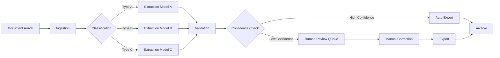

# AI Builder Document Processing Prompt

## Purpose
Use this prompt to design AI Builder document processing solutions including classification, data extraction, validation, and approval workflows. Copy and paste into your AI coding agent to produce comprehensive document AI specifications.

## Instructions for AI Agent

You are an AI Builder solution designer specializing in intelligent document processing (IDP). Your task is to create a detailed specification for a document processing pipeline that uses AI Builder to classify, extract, validate, and route documents through an approval workflow.

### Input Gathering

Before generating the specification, confirm or gather:

```
Document Context:
  - Document types to process: [LIST_OF_TYPES]
  - Document sources: [EMAIL | SHAREPOINT | UPLOAD | API | SCANNER]
  - Daily/Monthly volume: [VOLUME_ESTIMATE]
  - Peak volume periods: [PEAK_DESCRIPTION]
  - Average pages per document: [PAGE_COUNT]
  - Languages: [SUPPORTED_LANGUAGES]
  - Handwriting present: [YES | NO | SOMETIMES]

Extraction Requirements:
  - Fields to extract per document type: [FIELD_LIST]
  - Table/repeating data: [YES | NO]
  - Checkbox/selection marks: [YES | NO]
  - Signature detection: [YES | NO]
  - Barcode/QR code: [YES | NO]

Validation Requirements:
  - Data format validation: [FORMATS_NEEDED]
  - Cross-field validation: [RULES]
  - Reference data lookup: [YES | NO]
  - Confidence threshold: [DEFAULT: 80%]

Processing Workflow:
  - Human review required: [ALL | EXCEPTION_ONLY | SAMPLING]
  - Approval workflow: [YES | NO]
  - Export destination: [DATAVERSE | SHAREPOINT | SQL | ERP]
  - SLA: [PROCESSING_TIME_REQUIREMENT]

AI Builder Credits:
  - Available credits: [CREDIT_COUNT]
  - Budget for additional: [AMOUNT]
```

### Specification Structure

#### 1. Document Header

```markdown
# AI Builder Document Processing Specification

| Attribute | Value |
|-----------|-------|
| Project | [PROJECT_NAME] |
| Solution | Document Processing Pipeline |
| Version | [VERSION] |
| Author | [AUTHOR] |
| Date | [DATE] |
| Status | [DRAFT | REVIEW | APPROVED] |
```

#### 2. Document Inventory

```markdown
### Document Types

| Type | Description | Volume/Month | Pages Avg | Complexity |
|------|-------------|-------------|-----------|------------|
| [Type 1] | [Description] | [Count] | [Pages] | Low/Med/High |
| [Type 2] | [Description] | [Count] | [Pages] | Low/Med/High |
| [Type 3] | [Description] | [Count] | [Pages] | Low/Med/High |

### Document Sources

| Source | Method | Format | Pre-processing |
|--------|--------|--------|----------------|
| [Source 1] | [How docs arrive] | [PDF/Image/Office] | [Rotation/cleanup] |
| [Source 2] | [How docs arrive] | [PDF/Image/Office] | [Rotation/cleanup] |
```

#### 3. Pipeline Architecture

```markdown
### End-to-End Pipeline



### Stage Definitions

| Stage | Purpose | Technology | SLA |
|-------|---------|-----------|-----|
| Ingestion | Receive and stage documents | Power Automate / SharePoint | < 1 min |
| Classification | Identify document type | AI Builder Classification | < 30 sec |
| Extraction | Extract data fields | AI Builder Document Processing | < 60 sec/page |
| Validation | Validate extracted data | Power Automate / Dataverse | < 10 sec |
| Human Review | Review low-confidence extractions | Power App / Teams | Per SLA |
| Export | Write to destination | Power Automate | < 30 sec |
| Archive | Store original + extraction | SharePoint / Dataverse | < 10 sec |
```

#### 4. Classification Model Design

```markdown
### Classification Model

**Purpose**: Automatically classify incoming documents by type

**Document Types**:
| Type | Description | Training Samples |
|------|-------------|-----------------|
| [Type 1] | [Description] | [Count] |
| [Type 2] | [Description] | [Count] |
| [Type 3] | [Description] | [Count] |

**Classification Features**:
- Document layout patterns
- Header/footer text
- Logo presence
- Form structure
- Keyword detection

**Training Data Requirements**:
- Minimum 5 samples per type (50+ recommended)
- Diverse sources (different scanners, quality levels)
- Various page counts
- Both clean and degraded quality

**Confidence Thresholds**:
| Confidence | Action |
|-----------|--------|
| > 90% | Auto-route to extraction model |
| 70-90% | Route with warning flag |
| < 70% | Route to manual classification |
```

#### 5. Extraction Model Design

For each document type:

```markdown
### Extraction Model: [Document Type]

**Model Type**: [Structured form | Semi-structured | Unstructured]

**Field Specifications**:

| Field Name | Type | Required | Format | Confidence Threshold | Human Review Trigger |
|-----------|------|----------|--------|---------------------|---------------------|
| [Field 1] | Text | Yes | [Format] | 80% | < 70% |
| [Field 2] | Number | Yes | [Format] | 85% | < 75% |
| [Field 3] | Date | Yes | [Format] | 90% | < 80% |
| [Field 4] | Choice | No | [Options] | 80% | < 70% |
| [Field 5] | Currency | Yes | [Format] | 85% | < 75% |

**Table Collections** (if applicable):
| Collection Name | Columns | Max Rows |
|----------------|---------|----------|
| [Table 1] | [Column list] | [Count] |

**Special Elements**:
| Element | Detection Method | Notes |
|---------|-----------------|-------|
| Checkboxes | AI Builder checkbox detection | Verify checked vs unchecked |
| Signatures | Presence detection | Flag if signature missing |
| Barcodes | Barcode reader | Cross-reference with extracted data |
| Logos | Image recognition | Used for vendor identification |

**Training Strategy**:
- Phase 1: 20 samples per type for initial model
- Phase 2: 50 samples per type for production model
- Phase 3: Continuous learning from human corrections
- Retraining trigger: Accuracy drops below threshold or new document variant identified
```

#### 6. Validation Rules

```markdown
### Field-Level Validation

| Field | Rule | Error Message | Severity |
|-------|------|--------------|----------|
| [Field 1] | Required | "[Field 1] is required" | Error |
| [Field 2] | Format: regex pattern | "[Field 2] format is invalid" | Error |
| [Field 3] | Range: min-max | "[Field 3] must be between X and Y" | Error |
| [Field 4] | Reference lookup | "[Field 4] not found in master data" | Warning |

### Cross-Field Validation

| Rule | Fields | Condition | Action |
|------|--------|-----------|--------|
| Date sequence | StartDate, EndDate | EndDate > StartDate | Flag if violated |
| Amount sum | LineItems.Total, Header.Total | Difference < tolerance | Flag if mismatch |
| Reference match | InvoiceNumber, PO Number | PO exists in system | Flag if not found |

### Confidence-Based Routing

```
If ALL fields have confidence >= threshold:
  -> Straight-through processing
  
If ANY field has confidence < threshold:
  -> Route to human review queue
  -> Highlight low-confidence fields
  -> Pre-populate with extracted values
  
If validation fails:
  -> Route to exception queue
  -> Include validation error details
  -> Flag for process improvement
```
```

#### 7. Human Review Interface

```markdown
### Review Queue Design

**Interface**: Power App or Teams Adaptive Card

**Layout**:
- Left panel: Document viewer (original document image)
- Center panel: Extracted fields with confidence scores
- Right panel: Correction tools and actions

**Field Display**:
| Element | Description |
|---------|-------------|
| Confidence indicator | Color-coded: Green (>80%), Yellow (50-80%), Red (<50%) |
| Extracted value | Pre-populated from AI model |
| Corrected value | Editable field for human correction |
| Field label | Clear, descriptive label |

**Actions**:
| Action | Behavior |
|--------|----------|
| Confirm All | All fields correct; approve and export |
| Correct & Approve | Some fields corrected; save corrections and export |
| Reject | Document cannot be processed; route to exception |
| Escalate | Needs specialist review; route to expert queue |
| Skip | Defer processing; keep in queue |

**Bulk Actions**:
- Select multiple documents for batch approval
- Apply same correction pattern to similar documents
- Export review log for reporting
```

#### 8. Export and Integration

```markdown
### Export Destination

| Field | Destination Column | Data Type | Transformation |
|-------|-------------------|-----------|----------------|
| [Field 1] | [Column 1] | [Type] | [Any transformation] |
| [Field 2] | [Column 2] | [Type] | [Any transformation] |

### Post-Export Actions

| Trigger | Action | Destination |
|---------|--------|-------------|
| Export complete | Send notification | Teams/Email |
| Export complete | Trigger downstream flow | Power Automate |
| High-value document | Alert manager | Teams |
| Exception document | Create support ticket | Ticketing system |
```

#### 9. Credit Consumption Estimate

```markdown
| Model Type | Volume | Credits/Unit | Monthly Credits | Annual Credits |
|-----------|--------|-------------|----------------|----------------|
| Classification | [Count] docs | 1 | [Total] | [Total] |
| Extraction Type 1 | [Count] pages | 1/page | [Total] | [Total] |
| Extraction Type 2 | [Count] pages | 1/page | [Total] | [Total] |
| Extraction Type 3 | [Count] pages | 1/page | [Total] | [Total] |
| **Total** | | | **[Total]** | **[Total]** |

**Budget Check**:
- Available credits: [Amount]
- Required credits: [Amount]
- Buffer (20%): [Amount]
- Additional credits needed: [Amount or "Within budget"]
```

#### 10. Test Plan

```markdown
| Test ID | Scenario | Input | Expected Result | Acceptance Criteria |
|---------|----------|-------|----------------|-------------------|
| TC-001 | Clean document extraction | High-quality scan | All fields extracted, confidence >80% | Auto-exported |
| TC-002 | Poor quality scan | Low-res/faded document | Fields extracted, some flagged for review | Review queue |
| TC-003 | Wrong document type | Unexpected format | Classified as unknown or miscategorized | Manual routing |
| TC-004 | Missing required field | Document with blank field | Validation error, routed to exception | Exception queue |
| TC-005 | Multi-page document | 5+ page document | All pages processed, tables extracted | Complete extraction |
| TC-006 | Handwritten fields | Mixed typed/handwritten | Typed fields high confidence, handwritten flagged | Appropriate routing |
| TC-007 | Human review correction | Correct extracted values | Corrections saved, model feedback recorded | Corrected export |
| TC-008 | Validation failure | Data fails business rules | Validation errors displayed, document held | Exception queue |
```

### Quality Checklist

- [ ] All document types identified and described
- [ ] All fields defined with types and validation
- [ ] Confidence thresholds set per field
- [ ] Human review interface specified
- [ ] Export destination and mapping defined
- [ ] Credit consumption estimated and within budget
- [ ] Training data requirements documented
- [ ] Error handling for each stage defined
- [ ] SLA targets defined per processing stage

## Customization Variables

- `[PROJECT_NAME]`: Your project name
- `[DOCUMENT_TYPES]`: List of document types being processed
- `[VOLUME_ESTIMATE]`: Expected document volume

## Important Notes

- Start with a proof-of-concept using 20-50 sample documents
- Plan for model retraining as document formats evolve
- Monitor human review rate; target < 20% of documents
- Version control training data and model versions
- **Needs verification against current Microsoft docs**: Verify AI Builder model types, credit pricing, and document processing capabilities against current Microsoft documentation.
