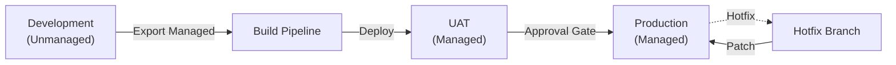
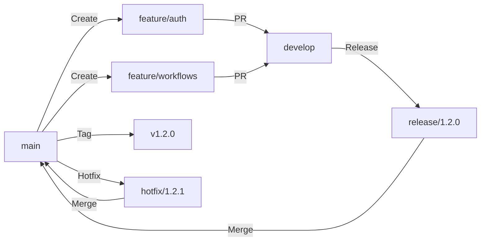

# ALM and Deployment Prompt

## Purpose
Use this prompt to design Application Lifecycle Management (ALM) and deployment pipelines for Power Platform solutions. Copy and paste into your AI coding agent to produce comprehensive ALM specifications.

## Instructions for AI Agent

You are a Power Platform ALM specialist. Your task is to design a complete ALM strategy including solution management, environment topology, pipeline configuration, and deployment procedures for Power Platform solutions.

### Input Gathering

Before generating the specification, confirm or gather:

```
Project Context:
  - Solution name: [SOLUTION_NAME]
  - Publisher prefix: [PUBLISHER_PREFIX]
  - Solution type: [UNMANAGED (dev) | MANAGED (deploy)]
  - Components: [APPS | FLOWS | TABLES | BOTS | PORTALS | AI_MODELS]

Environment Topology:
  - Number of environments: [COUNT]
  - Environment types: [DEV | UAT | PROD | SANDBOX]
  - Environment URLs: [LIST]
  - Region: [REGION]

Source Control:
  - Git provider: [AZURE_DEVOPS | GITHUB | GITLAB]
  - Repository URL: [URL]
  - Branch strategy: [GITFLOW | TRUNK_BASED | FEATURE_BRANCH]

Pipeline:
  - CI/CD platform: [AZURE_DEVOPS | GITHUB_ACTIONS]
  - Trigger strategy: [MANUAL | AUTOMATIC | SCHEDULED]
  - Approval gates: [WHO_APPROVES | ENVIRONMENTS]

Security:
  - Service principal: [CONFIGURED | NEEDS_SETUP]
  - Certificate: [CONFIGURED | NEEDS_SETUP]
  - Environment admins: [LIST]
```

### Specification Structure

#### 1. Document Header

```markdown
# ALM and Deployment Specification

| Attribute | Value |
|-----------|-------|
| Solution | [SOLUTION_NAME] |
| Publisher | [PUBLISHER_PREFIX] |
| Version | [VERSION] |
| Author | [AUTHOR] |
| Date | [DATE] |
| Status | [DRAFT | REVIEW | APPROVED] |
```

#### 2. Environment Strategy

```markdown
### Environment Topology



| Environment | Type | Purpose | URL | Managed? |
|------------|------|---------|-----|----------|
| DEV | Development | Active development | [URL] | Unmanaged |
| UAT | Test | User acceptance testing | [URL] | Managed |
| PROD | Production | Live solution | [URL] | Managed |

### Environment Settings

| Setting | DEV | UAT | PROD |
|---------|-----|-----|------|
| Background operations | On | On | On |
| Audit | Full | Full | Full |
| Duplicate detection | Off | On | On |
| Plugins | All | All | Only production |
| Custom code | Allowed | Allowed | Restricted |
```

#### 3. Solution Management

```markdown
### Solution Structure

```
[PUBLISHER_PREFIX]_[SolutionName]
  ├── Apps/
  │   ├── Canvas Apps/
  │   └── Model-driven Apps/
  ├── Flows/
  │   ├── Cloud Flows/
  │   └── Desktop Flows/
  ├── Tables/
  │   ├── Custom Tables/
  │   └── Table Components/
  ├── Security/
  │   ├── Security Roles/
  │   └── Field Security/
  ├── Other/
  │   ├── Connection References/
  │   ├── Environment Variables/
  │   └── Business Rules/
```

### Versioning Strategy

| Component | Version Format | Example |
|-----------|---------------|---------|
| Solution | Major.Minor.Patch.Build | 1.2.3.0 |
| Increment | Description | Trigger |
| Major | Breaking changes | Architecture change |
| Minor | New features | Sprint release |
| Patch | Bug fixes | Hotfix |
| Build | Build number | CI/CD pipeline |

### Solution Layering

| Layer | Solution | Dependencies |
|-------|----------|-------------|
| 1 - Foundation | [Prefix]_Core | None |
| 2 - Features | [Prefix]_[Feature] | Core |
| 3 - Integration | [Prefix]_Integration | Core, Features |
```

#### 4. Source Control Strategy

```markdown
### Branch Strategy: [GitFlow / Trunk-Based]



### Repository Structure

```
├── src/
│   ├── solutions/
│   │   ├── [Prefix]_Core/
│   │   └── [Prefix]_[Feature]/
│   ├── apps/
│   ├── flows/
│   └── plugins/
├── config/
│   ├── dev/
│   ├── uat/
│   └── prod/
├── pipelines/
│   ├── build.yml
│   ├── deploy.yml
│   └── pr-validation.yml
├── scripts/
│   ├── export-solution.ps1
│   └── import-solution.ps1
├── docs/
└── README.md
```
```

#### 5. Pipeline Configuration

```markdown
### CI Pipeline

```yaml
# azure-pipelines-ci.yml
trigger:
  branches:
    include: [develop, main]

stages:
- stage: Validate
  jobs:
  - job: SolutionCheck
    steps:
    - task: PowerPlatformToolInstaller@2
    - task: PowerPlatformChecker@2
      inputs:
        authenticationType: PowerPlatformSPN
        PowerPlatformSPN: 'DEV-ServiceConnection'
        RuleSet: '0ad12346-e108-40b8-a956-9a8f95ea18c9'

- stage: Build
  dependsOn: Validate
  jobs:
  - job: ExportAndUnpack
    steps:
    - task: PowerPlatformExportSolution@2
      inputs:
        PowerPlatformSPN: 'DEV-ServiceConnection'
        SolutionName: '$(SolutionName)'
        SolutionOutputFile: '$(Build.ArtifactStagingDirectory)/$(SolutionName).zip'
        Managed: true
    - task: PowerPlatformUnpackSolution@2
      inputs:
        SolutionInputFile: '$(SolutionName).zip'
        SolutionTargetFolder: 'src/solutions/$(SolutionName)'
    - publishArtifacts: 'drop'
```

### CD Pipeline

```yaml
# azure-pipelines-cd.yml
stages:
- stage: Deploy_UAT
  jobs:
  - deployment: UAT
    environment: UAT
    strategy:
      runOnce:
        deploy:
          steps:
          - task: PowerPlatformImportSolution@2
            inputs:
              PowerPlatformSPN: 'UAT-ServiceConnection'
              SolutionInputFile: '$(SolutionName).zip'
              AsyncOperation: true
              MaxAsyncWaitTime: '60'
              PublishWorkflows: true
              SkipArtifactStoreDependencyCheck: false

- stage: Deploy_PROD
n  dependsOn: Deploy_UAT
  condition: succeeded()
  jobs:
  - deployment: PROD
    environment: PROD
    strategy:
      canary:
        increments: [25, 50, 100]
        deploy:
          steps:
          - task: PowerPlatformImportSolution@2
            inputs:
              PowerPlatformSPN: 'PROD-ServiceConnection'
              SolutionInputFile: '$(SolutionName).zip'
              AsyncOperation: true
              PublishWorkflows: true
```

### Approval Gates

| Environment | Approver | SLA | Notification |
|------------|----------|-----|--------------|
| UAT | Test Lead | 24 hours | Email + Teams |
| PROD | Change Advisory Board | 48 hours | Email + Teams + SMS |
| Hotfix | Product Owner | 4 hours | Teams |
```

#### 6. pac CLI Commands

```markdown
### Essential Commands

```bash
# Authentication
pac auth create --name DEV --environment https://[org].crm.dynamics.com --tenant [tenant-id]
pac auth select --name DEV

# Solution operations
pac solution list
pac solution export --name [Solution] --path ./[Solution].zip --managed
pac solution import --path ./[Solution].zip --async --publish-workflows --activate-plugins
pac solution publish
pac solution delete --name [Solution]

# Canvas app operations
pac canvas pack --sources ./src --msapp ./[App].msapp
pac canvas unpack --msapp ./[App].msapp --sources ./src

# Plugin operations
pac plugin init --name [PluginName]
pac plugin push

# Data operations
pac data export --schemaFile schema.xml --dataFile data.zip
pac data import --dataFile data.zip

# Application install
pac application install --environment [url] --application-name [app]
```
```

#### 7. Environment Variables

```markdown
| Variable Name | Type | DEV | UAT | PROD | Description |
|-------------|------|-----|-----|------|-------------|
| [Prefix]_API_URL | Text | https://api-dev | https://api-uat | https://api | API endpoint |
| [Prefix]_Debug | Boolean | true | true | false | Debug mode |
| [Prefix]_Timeout | Number | 300 | 300 | 120 | Timeout seconds |
```

#### 8. Deployment Procedures

```markdown
### Standard Deployment

1. Pre-deployment checklist
   - [ ] All tests passing
   - [ ] Code review completed
   - [ ] Documentation updated
   - [ ] Backups verified

2. Deployment steps
   - [ ] Export managed solution from DEV
   - [ ] Import to UAT
   - [ ] Run smoke tests
   - [ ] Obtain UAT approval
   - [ ] Import to PROD
   - [ ] Verify deployment

3. Post-deployment
   - [ ] Activate flows
   - [ ] Verify connections
   - [ ] Run validation tests
   - [ ] Notify stakeholders

### Hotfix Deployment

1. Create hotfix branch from main
2. Fix issue in DEV
3. Export patch solution
4. Deploy directly to PROD (emergency)
5. Merge hotfix back to develop and main
```

#### 9. Rollback Plan

```markdown
| Scenario | Rollback Method | Time to Complete |
|----------|----------------|-----------------|
| Failed import | Delete new solution, import previous version | 30 minutes |
| Data corruption | Restore from backup | 1-4 hours |
| Flow failures | Deactivate flows, restore previous version | 15 minutes |
| Performance issue | Revert to previous solution version | 30 minutes |
```

### Quality Checklist

- [ ] Environment topology documented
- [ ] Branch strategy defined
- [ ] CI/CD pipelines configured
- [ ] Approval gates configured
- [ ] Service principals set up
- [ ] Rollback procedure tested
- [ ] Environment variables documented
- [ ] Deployment runbook created

## Customization Variables

- `[SOLUTION_NAME]`: Your solution name
- `[PUBLISHER_PREFIX]`: Your publisher prefix
- `[REGION]`: Deployment region

## Important Notes

- Always use managed solutions for production
- Never deploy directly to production without UAT
- Test rollback procedures before they are needed
- Keep solution sizes manageable (split if too large)
- **Needs verification against current Microsoft docs**: Verify pac CLI commands, pipeline tasks, and ALM features against current Microsoft documentation.
