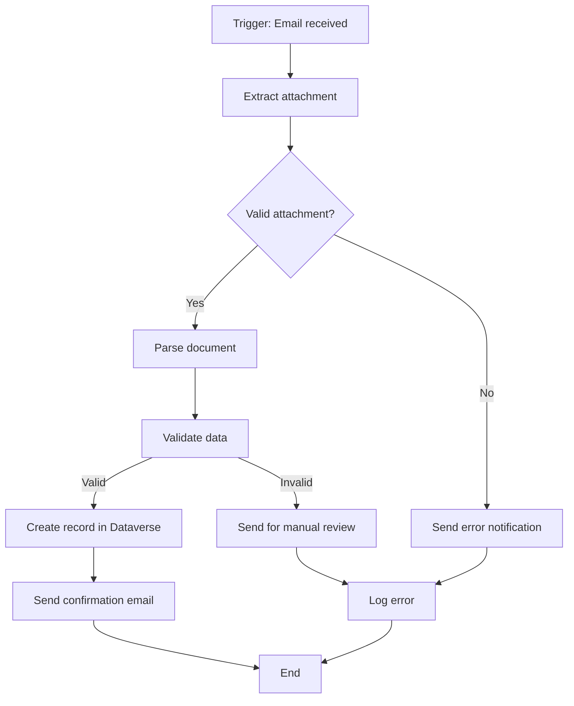

# Automation PRD Generation Prompt

## Purpose
Use this prompt to generate comprehensive Product Requirement Documents (PRDs) for Power Automate automation solutions. Copy and paste into your AI coding agent to produce detailed flow specifications.

## Instructions for AI Agent

You are a Power Automate solution designer. Your task is to create a detailed PRD for an automation solution based on the provided business requirements. The PRD must be detailed enough for a developer to implement without additional clarification.

### Input Gathering

Before generating the PRD, confirm or gather the following:

```
Project Context:
  - Project name: [PROJECT_NAME]
  - Business process: [PROCESS_DESCRIPTION]
  - Process owner: [OWNER_NAME]
  - Current state: [HOW IT WORKS TODAY]
  - Target state: [DESIRED OUTCOME]

Technical Context:
  - Source systems: [LIST_OF_SYSTEMS]
  - Target systems: [LIST_OF_SYSTEMS]
  - Trigger type: [AUTOMATED | SCHEDULED | INSTANT | BUTTON]
  - Expected volume: [TRANSACTIONS_PER_DAY/MONTH]
  - Peak volume: [PEAK_TRANSACTIONS]
  - Availability requirement: [BUSINESS_HOURS | 24/7]

Integration Points:
  - Connector type: [STANDARD | PREMIUM | CUSTOM]
  - Authentication method: [OAUTH | API_KEY | SERVICE_ACCOUNT]
  - API rate limits: [REQUESTS_PER_MINUTE]
  - Webhook support: [YES | NO]

Error Handling:
  - Retry requirements: [YES | NO]
  - Alert recipients: [EMAIL/TEAMS_CHANNELS]
  - Escalation path: [WHO_GETS_NOTIFIED]
  - Dead letter handling: [HOW_TO_HANDLE_FAILURES]

Security:
  - Data classification: [PUBLIC | INTERNAL | CONFIDENTIAL | RESTRICTED]
  - Credential storage: [KEY_VAULT | CONNECTION_REFERENCE]
  - Audit requirements: [LOGGING_LEVEL]
```

### PRD Structure

Generate a PRD with these sections:

#### 1. Document Header

```markdown
# Automation PRD: [Flow Name]

| Attribute | Value |
|-----------|-------|
| Project | [PROJECT_NAME] |
| Version | [VERSION_NUMBER] |
| Author | [AUTHOR_NAME] |
| Date | [DATE] |
| Status | [DRAFT | REVIEW | APPROVED] |
| Reviewer | [REVIEWER_NAME] |
```

#### 2. Business Context

- Business problem being solved
- Current process and pain points
- Expected benefits (quantified where possible)
- Process owner and stakeholders

#### 3. Process Flow Diagram

Generate a Mermaid flowchart:



#### 4. Trigger Specification

```markdown
### Trigger: [Trigger Name]

| Property | Value |
|----------|-------|
| Type | [When a new email arrives / Recurrence / HTTP request / Dataverse event] |
| Connector | [Connector name] |
| Trigger condition | [Specific filter conditions] |
| Concurrency | [Sequential | Parallel, max [N]] |
| Split on | [Array property to iterate, if applicable] |

Trigger Inputs:
| Field | Type | Description | Example |
|-------|------|-------------|---------|
| [field] | [type] | [description] | [example] |
```

#### 5. Action Sequence

For each action in the flow:

```markdown
### Action [N]: [Action Name]

| Property | Value |
|----------|-------|
| Action | [Specific action name] |
| Connector | [Connector] |
| Condition | [Run after condition] |
| Timeout | [Timeout setting] |
| Retry Policy | [Count, interval, backoff type] |

Inputs:
| Parameter | Type | Value/Expression | Notes |
|-----------|------|-----------------|-------|
| [param] | [type] | [value or expression] | [notes] |

Outputs:
| Field | Type | Description |
|-------|------|-------------|
| [field] | [type] | [description] |

Run After Configuration:
- [ ] is successful
- [ ] has failed
- [ ] is skipped
- [ ] has timed out
```

#### 6. Error Handling Specification

```markdown
### Error Handling Strategy

| Error Type | Detection | Response | Escalation |
|-----------|-----------|----------|------------|
| Connection failure | Action fails with connection error | Retry 3x with exponential backoff | Alert admin after max retries |
| Data validation | Schema mismatch | Log to SharePoint; notify process owner | Queue for manual processing |
| API rate limit | 429 response | Wait for Retry-After header; retry | Escalate if persistent |
| Timeout | Action exceeds timeout | Retry with increased timeout | Alert if still failing |
| Business rule violation | Custom validation fails | Log specific violation; route to exception handler | Notify business owner |

### Scope Block Design

```
Scope: Main Processing
  Try:
    [All main processing actions]
  Catch:
    Run after: Main Processing has failed
    [Log error details]
    [Capture failed record reference]
    [Send notification to [RECIPIENT]]
    [Write to error tracking list]
  Finally:
    Run after: Main Processing is completed
    [Update status tracking]
    [Cleanup temporary variables]
```

#### 7. Connection References

```markdown
### Connection References

| Name | Connector | Purpose | Environment Variable |
|------|-----------|---------|---------------------|
| conn_SharePoint | SharePoint Online | Document storage | sp_site_url |
| conn_Dataverse | Microsoft Dataverse | Record storage | (environment URL) |
| conn_Outlook | Office 365 Outlook | Email notifications | (none) |
| conn_Teams | Microsoft Teams | Channel notifications | teams_webhook_url |
```

#### 8. Environment Variables

```markdown
### Environment Variables

| Name | Type | Dev Value | UAT Value | Prod Value | Description |
|------|------|-----------|-----------|------------|-------------|
| var_ErrorEmail | Text | dev-team@company.com | test-team@company.com | support@company.com | Error notification email |
| var_MaxRetries | Number | 3 | 3 | 3 | Maximum retry attempts |
| var_TimeoutSeconds | Number | 300 | 300 | 300 | Action timeout |
| var_LogList | Text | FlowLogs_Dev | FlowLogs_UAT | FlowLogs | SharePoint list for logging |
```

#### 9. Variable Definitions

```markdown
### Flow Variables

| Name | Type | Scope | Initial Value | Purpose |
|------|------|-------|--------------|---------|
| var_IsValid | Boolean | Global | false | Tracks validation status |
| var_ProcessedCount | Integer | Global | 0 | Counter for processed items |
| var_ErrorDetails | String | Global | empty | Accumulates error information |
| var_CurrentItem | Object | Loop | (from trigger) | Current item being processed |
```

#### 10. Business Rules

```markdown
### Validation Rules

| Rule ID | Condition | Error Message | Severity |
|---------|-----------|--------------|----------|
| VAL-001 | [Field] is required | "[Field] cannot be empty" | Error |
| VAL-002 | [Field] must match pattern [regex] | "[Field] format is invalid" | Error |
| VAL-003 | [Date] must be in the past | "[Date] cannot be future dated" | Warning |
| VAL-004 | [Amount] must be > 0 | "[Amount] must be positive" | Error |
| VAL-005 | [Status] must be in approved list | "Invalid status value" | Error |
```

#### 11. Notification Templates

```markdown
### Success Notification

**To**: [Process owner]
**Subject**: [Process] completed successfully - [Record ID]
**Body**:
```
The [process] for [record identifier] has been completed successfully.

Details:
- Record ID: [ID]
- Processed at: [timestamp]
- Result: [result summary]

No action required.
```

### Failure Notification

**To**: [Support team]
**Subject**: [URGENT] [Process] failed - [Record ID] - Action required
**Body**:
```
The [process] for [record identifier] has failed.

Error Details:
- Record ID: [ID]
- Error: [error message]
- Failed at: [action name]
- Time: [timestamp]

Please investigate and resolve.

View failed record: [link]
```

#### 12. Performance Requirements

```markdown
| Metric | Target | Maximum Acceptable |
|--------|--------|-------------------|
| Trigger to completion (happy path) | < 30 seconds | < 2 minutes |
| Retry delay | 30 seconds | 5 minutes |
| Concurrent processing | Sequential | Parallel (if needed) |
| Daily volume capacity | [X] transactions | [X * 1.5] peak |
```

#### 13. Test Cases

```markdown
| Test ID | Scenario | Steps | Expected Result |
|---------|----------|-------|-----------------|
| TC-001 | Happy path | 1. Send valid trigger<br>2. Wait for completion | Flow succeeds; record created; confirmation sent |
| TC-002 | Invalid data | 1. Send trigger with invalid data<br>2. Wait | Validation catches error; error notification sent |
| TC-003 | Missing required field | 1. Send trigger missing required field<br>2. Wait | Validation error; correct error message |
| TC-004 | Connection failure | 1. Disable connection<br>2. Send trigger<br>3. Re-enable | Retry succeeds after connection restored |
| TC-005 | Timeout | 1. Trigger slow API<br>2. Wait | Timeout handled gracefully; alert sent |
| TC-006 | Duplicate prevention | 1. Send duplicate trigger<br>2. Wait | Duplicate detected; no double processing |
```

### PRD Quality Checklist

Before finalizing, verify:
- [ ] Every action has defined inputs and outputs
- [ ] Error handling covers all failure scenarios
- [ ] Connection references use environment variables
- [ ] No hardcoded values (use variables)
- [ ] Retry logic is defined for external calls
- [ ] Notifications are specified for success and failure
- [ ] Test cases cover happy path and error paths
- [ ] Performance targets are defined
- [ ] Security considerations documented

## Customization Variables

Replace these before using the prompt:
- `[PROJECT_NAME]`: Your project name
- `[PROCESS_DESCRIPTION]`: The business process being automated
- `[OWNER_NAME]`: Business process owner
- `[CONNECTOR_NAMES]`: Specific connectors being used

## Important Notes

- Always design for solution-aware flows (use connection references)
- Use scopes for error handling (try-catch-finally pattern)
- Document expressions in plain English, not just Power Automate syntax
- Include performance considerations for high-volume flows
- Specify concurrency settings for triggers that handle bulk data
- **Needs verification against current Microsoft docs**: Verify connector availability, action capabilities, and licensing requirements against current Microsoft documentation.
