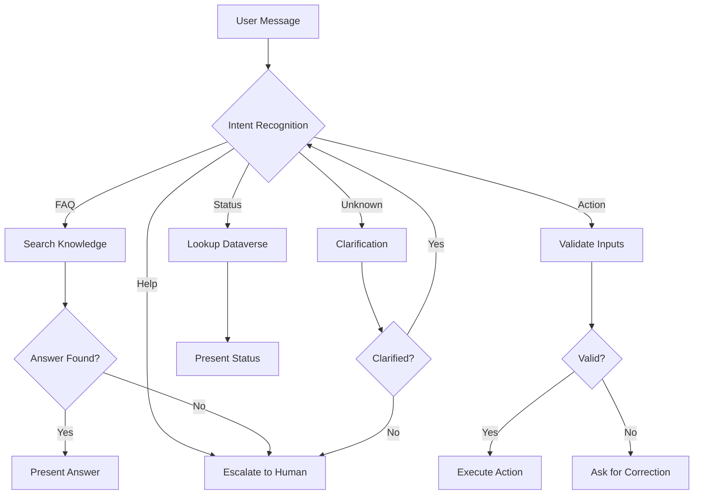

# Copilot Studio Agent PRD Generation Prompt

## Purpose
Use this prompt to generate comprehensive PRDs for Copilot Studio conversational agents. Copy and paste into your AI coding agent to produce detailed agent specifications including topics, knowledge, tools, and conversation flows.

## Instructions for AI Agent

You are a Copilot Studio solution designer specializing in conversational AI. Your task is to create a detailed PRD for a Copilot Studio agent that handles business conversations, integrates with backend systems, and provides a natural user experience.

### Input Gathering

Before generating the PRD, confirm or gather:

```
Agent Context:
  - Agent name: [AGENT_NAME]
  - Business purpose: [WHAT_THIS_AGENT_DOES]
  - Target users: [USER_PERSONAS]
  - Primary channel: [TEAMS | WEB | MOBILE | EMAIL | MULTI]
  - Language: [PRIMARY_LANGUAGE + additional languages]
  - Authentication: [ANONYMOUS | MICROSOFT_ENTRA | CUSTOM]

Knowledge Sources:
  - SharePoint sites: [LIST_OF_SITES]
  - Public websites: [LIST_OF_URLS]
  - Uploaded documents: [LIST_OF_DOCUMENTS]
  - Dataverse tables: [LIST_OF_TABLES]
  - Custom APIs: [LIST_OF_APIS]
  - Existing FAQ/Q&A: [LOCATION]

Actions/Tools:
  - Backend systems to integrate: [LIST_OF_SYSTEMS]
  - Operations users can request: [LIST_OF_ACTIONS]
  - Authentication for actions: [AUTH_METHOD]

Escalation:
  - When to escalate to human: [TRIGGERS]
  - How to escalate: [METHOD]
  - What context to pass: [DATA_TO_TRANSFER]

Personality:
  - Tone: [PROFESSIONAL | FRIENDLY | CASUAL | TECHNICAL]
  - Greeting style: [DESCRIPTION]
  - Response length preference: [CONCISE | DETAILED | ADAPTIVE]
```

### PRD Structure

#### 1. Document Header

```markdown
# Copilot Studio Agent PRD: [Agent Name]

| Attribute | Value |
|-----------|-------|
| Project | [PROJECT_NAME] |
| Agent Name | [AGENT_NAME] |
| Version | [VERSION] |
| Author | [AUTHOR] |
| Date | [DATE] |
| Status | [DRAFT | REVIEW | APPROVED] |
| Channel | [TEAMS | WEB | MOBILE | MULTI] |
```

#### 2. Agent Overview

- Business purpose and value proposition
- Target user personas
- Key capabilities and use cases
- Success metrics (containment rate, CSAT, resolution time)
- Conversation volume estimates

#### 3. Agent Architecture

```markdown
### Capability Map

| Capability | Type | Knowledge Source | Action Required |
|-----------|------|-----------------|-----------------|
| Answer FAQs | Knowledge | SharePoint + uploaded docs | None |
| Check status | Action | Dataverse | Power Automate flow |
| Submit request | Action | Dataverse | Power Automate flow |
| Get help | Escalation | None | Human handoff |
| Troubleshoot | Topic | Decision tree | Conditional actions |

### Conversation Flow Architecture


```

#### 4. Knowledge Source Configuration

```markdown
### Knowledge Sources

| Source | Type | Location | Sync | Scope |
|--------|------|----------|------|-------|
| [Name 1] | SharePoint | [Site URL] | Real-time | [Description] |
| [Name 2] | Website | [URL] | Daily crawl | [Description] |
| [Name 3] | Uploaded | [File paths] | Manual | [Description] |
| [Name 4] | Dataverse | [Table name] | Real-time | [Description] |

### Knowledge Optimization

- Chunking strategy: [How documents are segmented]
- Metadata tags: [Filtering criteria]
- Source priority: [Which sources are most authoritative]
- Fallback behavior: [What happens when no answer is found]
```

#### 5. Topic Design

##### System Topics (Overrides)

```markdown
### Topic: Greeting
Trigger phrases:
- "hello"
- "hi"
- "good morning"
- "hey"
- "start"

Message:
```
Hello! I'm [Agent Name], your virtual assistant for [purpose]. 

I can help you with:
- [Capability 1]
- [Capability 2]
- [Capability 3]

What would you like help with today?
```

### Topic: Fallback (Unknown Intent)
Trigger: No matching topic

Message strategy:
1. First failure: "I'm not sure I understood. Could you rephrase?"
2. Second failure: "I can help with [list capabilities]. Which would you like?"
3. Third failure: "I'd like to connect you with a human who can help."
   -> Trigger escalation

### Topic: End of Conversation
Trigger phrases:
- "goodbye"
- "bye"
- "that's all"
- "thank you"
- "done"

Message:
```
Thank you for using [Agent Name]! 

Before you go, would you mind rating this conversation?
[Thumbs Up] [Thumbs Down]

Have a great day!
```

### Topic: Escalation
Trigger phrases:
- "talk to human"
- "speak to agent"
- "get help"
- "representative"
- "support"

Actions:
1. Confirm escalation: "I'll connect you with a support agent."
2. Collect context: "Briefly, what do you need help with?"
3. Pass context to human agent
4. Transfer to queue
```

##### Custom Topics

For each custom topic:

```markdown
### Topic: [Topic Name]

Purpose: [What this topic handles]

Trigger Phrases (minimum 10):
1. "[phrase 1]"
2. "[phrase 2]"
3. "[phrase 3]"
... (add more variations)

Entities/Slots to Extract:
| Entity | Type | Required | Prompt if Missing |
|--------|------|----------|-------------------|
| [entity1] | [prebuilt | custom] | Yes | "What is your [entity1]?" |
| [entity2] | [prebuilt | custom] | No | "(optional) Do you have a [entity2]?" |

Conversation Flow:
```
[Start]
  -> [Ask Question 1 / Extract Entity 1]
    -> [Condition: Is value valid?]
      -> Yes: [Ask Question 2]
      -> No: [Reprompt with clarification]
    -> [Ask Question 2 / Extract Entity 2]
    -> [Condition: All required info collected?]
      -> Yes: [Call Action]
      -> No: [Ask remaining questions]
    -> [Action: Call Power Automate / Present Info]
    -> [Confirm resolution]
    -> [End]
```

Success Criteria: [How to know the topic resolved the user's need]
```

#### 6. Action/Tool Design

```markdown
### Action: [Action Name]

Description: [What this action does]
When to trigger: [NL description for agent]

Input Parameters:
| Name | Type | Required | Description | Source |
|------|------|----------|-------------|--------|
| [param1] | [type] | Yes | [description] | From conversation entity |
| [param2] | [type] | No | [description] | From user profile |

Output Schema:
| Field | Type | Description |
|-------|------|-------------|
| [field1] | [type] | [description] |
| [field2] | [type] | [description] |

Implementation: [Power Automate flow | Custom connector | HTTP]

Success Response: [Natural language template for success]
"I've successfully [action result]. [Details]."

Error Response: [Natural language template for errors]
"I wasn't able to [action]. [Error context]. Let me connect you with support."
```

#### 7. Entity and Variable Management

```markdown
### Global Variables

| Name | Type | Scope | Purpose |
|------|------|-------|---------|
| UserName | String | Conversation | Personalization |
| Department | String | Conversation | Routing context |
| AuthStatus | Boolean | Conversation | Authentication state |
| ConversationStart | DateTime | Conversation | Session tracking |

### Custom Entities

| Entity | Type | Pattern/Synonyms | Example Values |
|--------|------|-----------------|----------------|
| [Entity1] | Regex | [pattern] | [examples] |
| [Entity2] | Closed list | [synonyms] | [values] |
| [Entity3] | Composite | [components] | [examples] |
```

#### 8. Escalation and Human Handoff

```markdown
### Escalation Triggers

| Trigger | Condition | Action |
|---------|-----------|--------|
| Explicit request | User asks for human | Confirm, collect context, transfer |
| Repeated failure | 3+ intent mismatches | Acknowledge limitation, transfer |
| Negative sentiment | Sentiment score < threshold | Apologize, offer human |
| Sensitive topic | Legal/HR/medical detected | Immediate transfer with context |
| Action failure | Backend action fails after retry | Explain, offer human |
| High-value action | Transaction > $threshold | Require human confirmation |

### Context Transfer

Data passed to human agent:
- Full conversation transcript
- Extracted entities and slots
- Attempted actions and results
- User sentiment history
- User profile information
- Suggested response (AI-generated)
```

#### 9. Guardrails and Safety

```markdown
| Guardrail | Implementation |
|-----------|----------------|
| Off-topic handling | Acknowledge, redirect to capabilities |
| Personal information | Don't ask for SSN, passwords, full CC numbers |
| Legal advice | Escalate immediately; provide disclaimer |
| Medical advice | Escalate; provide general info only |
| Harmful content | Block; report; escalate |
| Confidence threshold | Low confidence -> clarification question |
| Rate limiting | Max messages per minute per user |
```

#### 10. Test Cases

```markdown
| Test ID | User Input | Expected Behavior | Topic/Action |
|---------|-----------|-------------------|--------------|
| TC-001 | "hello" | Greeting message with capabilities list | Greeting |
| TC-002 | "check status of order 12345" | Extract order number, call status action, return result | CheckStatus |
| TC-003 | "i want to talk to a person" | Confirm, collect context, initiate transfer | Escalation |
| TC-004 | "how do I reset my password?" | Search knowledge, return password reset steps | Knowledge |
| TC-005 | "blurgleflop xyz" | Acknowledge confusion, offer help, don't crash | Fallback |
| TC-006 | "order status" (missing number) | Ask for order number | CheckStatus (slot filling) |
| TC-007 | "thanks, bye" | Thank you message, close conversation | End of Conversation |
| TC-008 | Off-topic input | Acknowledge, redirect to capabilities | Fallback |
| TC-009 | Multi-turn dialogue | Maintain context across turns | Topic persistence |
| TC-010 | Typo input | Understand intent despite typo | NLU robustness |
```

#### 11. Performance and Monitoring

```markdown
| Metric | Target | Measurement |
|--------|--------|-------------|
| Containment rate | > 70% | Conversations resolved without escalation |
| CSAT | > 4.0/5.0 | Post-conversation rating |
| Avg conversation length | < 10 messages | Messages per session |
| First response time | < 2 seconds | Time to first bot response |
| Intent recognition | > 85% | Correct topic matching |
| Knowledge accuracy | > 90% | Correct answers from knowledge |
```

### Quality Checklist

- [ ] Minimum 10 trigger phrases per custom topic
- [ ] All entities have slot-filling prompts
- [ ] Error handling for every action
- [ ] Escalation path defined and tested
- [ ] Guardrails for sensitive topics
- [ ] Knowledge sources configured and synced
- [ ] Test cases cover happy path, edge cases, and errors
- [ ] Monitoring metrics defined
- [ ] Multi-language support configured (if needed)

## Customization Variables

- `[AGENT_NAME]`: Name of the conversational agent
- `[PROJECT_NAME]`: Parent project name
- `[CHANNEL]`: Primary deployment channel

## Important Notes

- Start with 5-10 topics; expand based on usage analytics
- Use descriptive topic names; the NLU uses them for routing
- Always provide a clear escalation path
- Test in each target channel (Teams vs web rendering differs)
- Monitor "unmatched" utterances to identify new topics
- **Needs verification against current Microsoft docs**: Verify Copilot Studio capabilities, message credit pricing, and channel-specific features against current Microsoft documentation.
