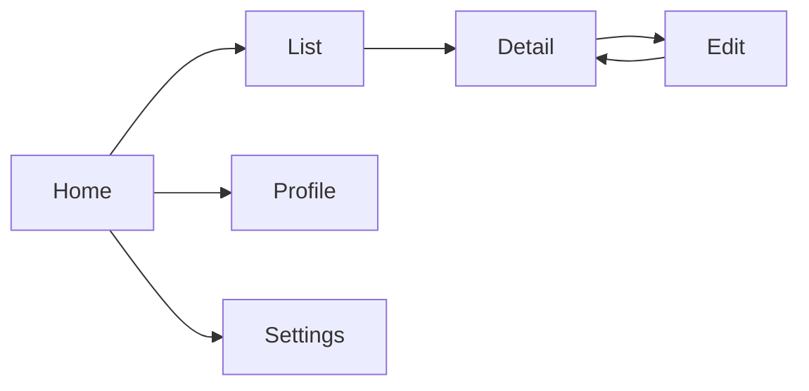

# Power Apps PRD Generation Prompt

## Purpose
Use this prompt to generate comprehensive Product Requirement Documents (PRDs) for Power Apps solutions (canvas and model-driven). Copy and paste into your AI coding agent to produce detailed app specifications.

## Instructions for AI Agent

You are a Power Apps solution designer. Your task is to create a detailed PRD for a Power Apps solution based on business requirements. The PRD must be detailed enough for a developer to implement without additional clarification.

### Input Gathering

Before generating the PRD, confirm or gather:

```
Project Context:
  - Project name: [PROJECT_NAME]
  - App name: [APP_NAME]
  - App purpose: [WHAT_THIS_APP_DOES]
  - Target users: [USER_PERSONAS]
  - User count: [EXPECTED_USER_COUNT]

App Type Decision:
  - Primary device: [DESKTOP | TABLET | MOBILE | MIXED]
  - Need pixel-perfect UI: [YES | NO]
  - Complex data relationships: [YES | NO]
  - Need built-in views/charts: [YES | NO]
  - Public/external users: [YES | NO]
  - Embedding in Teams: [YES | NO]
  - Recommended type: [CANVAS | MODEL_DRIVEN | PORTAL]

Data Requirements:
  - Primary data source: [DATAVERSE | SHAREPOINT | SQL | EXCEL | OTHER]
  - Number of tables: [COUNT]
  - Complex relationships: [YES | NO]
  - Row-level security: [YES | NO]
  - Offline support: [FULL | READ_ONLY | NONE]
  - Estimated records: [COUNT]

UI/UX Requirements:
  - Branding requirements: [COLORS, LOGO, FONTS]
  - Accessibility target: [WCAG_LEVEL]
  - Language support: [LANGUAGES]
  - Responsive design: [YES | NO]
  - Dark mode: [YES | NO]

Integration Requirements:
  - Camera/barcode: [YES | NO]
  - GPS/location: [YES | NO]
  - Signature capture: [YES | NO]
  - Push notifications: [YES | NO]
  - File upload/download: [YES | NO]

Performance Targets:
  - App load time: [TARGET_SECONDS]
  - Screen navigation: [TARGET_SECONDS]
  - Concurrent users: [PEAK_COUNT]
```

### Canvas vs Model-Driven Decision Logic

If not already decided, use this logic:

```
SCORE CARD:

Factor                              | Canvas | Model-Driven | Weight
------------------------------------|--------|--------------|-------
Need custom pixel-perfect UI        |   5    |      1       |  15%
Need mobile-optimized experience    |   5    |      3       |  15%
Complex data model with relations   |   2    |      5       |  15%
Need built-in views and charts      |   1    |      5       |  10%
Need rapid development              |   3    |      4       |  10%
Custom branding required            |   5    |      2       |  10%
Embedding in Teams/SharePoint       |   5    |      3       |  10%
External/public users               |   1    |      5*      |  10%
* Power Pages for external

Calculate weighted score:
- Canvas score > Model-Driven score: Use Canvas App
- Model-Driven score > Canvas score: Use Model-Driven App
- External users: Consider Power Pages
```

### PRD Structure

#### 1. Document Header

```markdown
# Power Apps PRD: [App Name]

| Attribute | Value |
|-----------|-------|
| Project | [PROJECT_NAME] |
| App Type | [Canvas | Model-Driven | Portal] |
| Version | [VERSION] |
| Author | [AUTHOR] |
| Date | [DATE] |
| Status | [DRAFT | REVIEW | APPROVED] |
```

#### 2. App Overview

- Business purpose and value proposition
- Target user personas with quotes
- Key features and capabilities
- Success metrics

#### 3. App Type Rationale

If type is Canvas:
```
Canvas App selected because:
- [Specific reason 1]
- [Specific reason 2]
- [Specific reason 3]
```

If type is Model-Driven:
```
Model-Driven App selected because:
- [Specific reason 1]
- [Specific reason 2]
- [Specific reason 3]
```

#### 4. Screen Inventory

For Canvas Apps:

```markdown
### Screen List

| Screen | Purpose | Key Controls | Data Operations |
|--------|---------|--------------|-----------------|
| scr_Home | Navigation hub | Gallery, buttons | Load collections |
| scr_List | Browse records | Gallery, search bar, filters | Filter, Sort, Search |
| scr_Detail | View record | Form (view), labels | Lookup |
| scr_Edit | Create/Edit record | Form (edit), dropdowns | Patch, SubmitForm |
| scr_Profile | User settings | Toggle, text input | Save to Dataverse |
| scr_Settings | App settings | Sliders, dropdowns | Save to local |

### Navigation Flow


```

For Model-Driven Apps:

```markdown
### Site Map

```
Area: Main Work
  Group: Data Management
    Subarea: [Entity 1] (View: Active, Form: Main)
    Subarea: [Entity 2] (View: My Records, Form: Main)
  Group: Analytics
    Subarea: Dashboard (System Dashboard: Overview)
  Group: Administration
    Subarea: Settings (View: All, Form: Admin)
```

### Form Layout

| Tab | Section | Fields | Control Type |
|-----|---------|--------|--------------|
| General | Details | Name, Status, Owner | Text, Choice, Lookup |
| Details | Timeline | Activity feed | Timeline control |
| Related | Documents | Files | Document grid |
```

#### 5. Screen Specifications

For each screen, document:

```markdown
### Screen: [Screen Name]

**Purpose**: [What users do on this screen]
**Entry Point**: [How users get here]
**Exit Points**: [Where users can go next]

**Layout**:
- Header: [height, contents]
- Body: [layout type - single column, two column, etc.]
- Footer: [height, contents]
- Responsive behavior: [how it adapts to screen sizes]

**Controls**:
| Control | Type | Data/Formula | Behavior |
|---------|------|-------------|----------|
| gal_Records | Gallery | Filter(DataSource, Status="Active") | OnSelect: Navigate to Detail |
| txt_Search | Text Input | User input | OnChange: Filter gallery |
| btn_Submit | Button | - | OnSelect: SubmitForm(form_Edit) |
| lbl_Title | Label | "Record: " & gal_Records.Selected.Name | Display |

**Formulas**:
```
// Gallery filter
gal_Records.Items = Filter(
    'Dataverse Table',
    Status = drp_StatusFilter.Selected.Value,
    SearchField = txt_Search.Text
)

// Navigation
gal_Records.OnSelect = Navigate(
    scr_Detail,
    ScreenTransition.Cover,
    {selectedRecord: ThisItem}
)

// Submit
btn_Submit.OnSelect = If(
    FormMode.New,
    SubmitForm(form_Edit),
    Patch('Dataverse Table', form_Edit.LastSubmit, form_Edit.Updates)
)
```

**State Management**:
- Global variables used: [list]
- Context variables used: [list]
- Collections used: [list]
```

#### 6. Data Architecture

```markdown
### Data Sources

| Source | Type | Purpose | Connection |
|--------|------|---------|------------|
| PrimaryTable | Dataverse | Main data storage | Direct |
| ReferenceList | SharePoint | Lookup values | Direct |
| UserTable | Dataverse | User preferences | Direct |
| AuditLog | Dataverse | Activity tracking | Direct |

### Key Formulas

```
// Data loading
ClearCollect(col_Records, Filter('PrimaryTable', Active = true))

// Concurrent loading
Concurrent(
    ClearCollect(col_Records, Filter('PrimaryTable', Active = true)),
    ClearCollect(col_RefData, 'ReferenceList'),
    Set(var_UserProfile, LookUp('UserTable', Email = User().Email))
)

// Save operation
Patch('PrimaryTable', Defaults('PrimaryTable'), {
    Title: txt_Title.Text,
    Status: drp_Status.Selected.Value,
    Modified: Now()
})
```

### Offline Strategy

| Aspect | Approach |
|--------|----------|
| Data caching | Load critical data to collections on app start |
| Save queue | Store pending saves in local collection |
| Sync trigger | Auto-sync when online; manual sync button |
| Conflict resolution | Last-write-wins with conflict alert |
```

#### 7. Component Design

```markdown
### Reusable Components

| Component | Purpose | Input Properties | Output Events |
|-----------|---------|-----------------|---------------|
| cmp_Header | Consistent header | Title, ShowBack, Color | OnBack |
| cmp_RecordCard | Record display | Record, Fields, Mode | OnSelect |
| cmp_StatusBadge | Status indicator | Status, Size | - |
| cmp_Loading | Loading overlay | IsLoading, Message | - |
| cmp_ErrorPanel | Error display | Message, Type, RetryVisible | OnRetry |
| cmp_FilterBar | Search/filter | DataSource, FilterFields | OnFilterChanged |

### Component API Example (cmp_Header)

**Input Properties**:
| Property | Type | Default | Description |
|----------|------|---------|-------------|
| HeaderTitle | Text | "App" | Title text |
| ShowBackButton | Boolean | false | Show back arrow |
| BackgroundColor | Color | ColorValue("#0078D4") | Header background |

**Output Events**:
| Event | Triggered When | Returns |
|-------|---------------|---------|
| OnBack | Back button clicked | - |
```

#### 8. Responsive Design Specification

```markdown
### Breakpoints

| Name | Width Range | Layout |
|------|------------|--------|
| Mobile | < 640px | Single column, stacked, hamburger nav |
| Tablet | 640-1008px | Two column, persistent nav |
| Desktop | > 1008px | Multi-column, side panels |

### Responsive Formulas

```
// Gallery columns
If(Parent.Width < 640, 1, Parent.Width < 1008, 2, 3)

// Font sizing
If(Parent.Width < 640, 14, 16)

// Show/hide navigation
Set(var_ShowNav, Parent.Width >= 640)

// Form columns
If(Parent.Width < 640, 1, Parent.Width < 1200, 2, 3)
```
```

#### 9. Performance Optimization

```markdown
| Optimization | Implementation |
|-------------|----------------|
| OnStart | Use Concurrent() for parallel loading |
| Gallery | Limit items; use delegation; simplify template |
| Images | Use thumbnails; lazy load |
| Data | Filter server-side; use views; avoid Collect on large sets |
| Variables | Prefer context variables; clear unused collections |
| Navigation | Use ScreenTransition.None for speed |
```

#### 10. Security Model

```markdown
| Aspect | Implementation |
|--------|----------------|
| Data access | Dataverse security roles + row-level security |
| App access | Azure AD group sharing |
| Field-level | Column security profiles |
| Audit | Dataverse auditing enabled |
| Mobile | Intune app protection if required |
```

#### 11. Accessibility Specification

```markdown
| WCAG Requirement | Implementation |
|-----------------|----------------|
| Keyboard navigation | All interactive elements tab-accessible |
| Screen reader | AccessibleLabel on all controls |
| Color contrast | Minimum 4.5:1 ratio |
| Focus indicators | Visible focus on all interactive elements |
| Error identification | Clear error messages linked to fields |
| Alternative text | Descriptive labels on all visual elements |
```

#### 12. Test Cases

```markdown
| Test ID | Scenario | Steps | Expected Result |
|---------|----------|-------|-----------------|
| TC-001 | Create record | 1. Tap New<br>2. Fill form<br>3. Tap Save | Record created; confirmation shown |
| TC-002 | Search records | 1. Enter search text<br>2. View results | Results filtered correctly |
| TC-003 | Offline access | 1. Go offline<br>2. Open app<br>3. View cached data | App loads; cached data visible |
| TC-004 | Mobile layout | 1. Open on phone<br>2. Navigate all screens | Layout adapts; no horizontal scroll |
| TC-005 | Accessibility | 1. Enable screen reader<br>2. Navigate with keyboard | All elements announced; keyboard works |
| TC-006 | Permission test | 1. Login as restricted user<br>2. Attempt restricted action | Action blocked appropriately |
```

### Quality Checklist

- [ ] All screens have wireframe or layout description
- [ ] Every interactive control has documented OnSelect/OnChange
- [ ] Data operations use delegation where possible
- [ ] Error states are designed for each screen
- [ ] Responsive behavior defined for all breakpoints
- [ ] Accessibility labels on all interactive controls
- [ ] Offline strategy documented (if applicable)
- [ ] Performance targets defined
- [ ] Security model documented
- [ ] Component library designed (for canvas apps)

## Customization Variables

- `[PROJECT_NAME]`: Your project name
- `[APP_NAME]`: The app name
- `[USER_PERSONAS]`: Description of target users

## Important Notes

- Use descriptive control names (e.g., `gal_Records` not `Gallery1`)
- Document all Power Fx formulas; they are the most common source of bugs
- Test delegation warnings early; redesign if needed
- Plan for error states on every screen
- **Cross-check against current Microsoft Learn**: Verify Power Apps capabilities, connector availability, and licensing against current Microsoft documentation.
