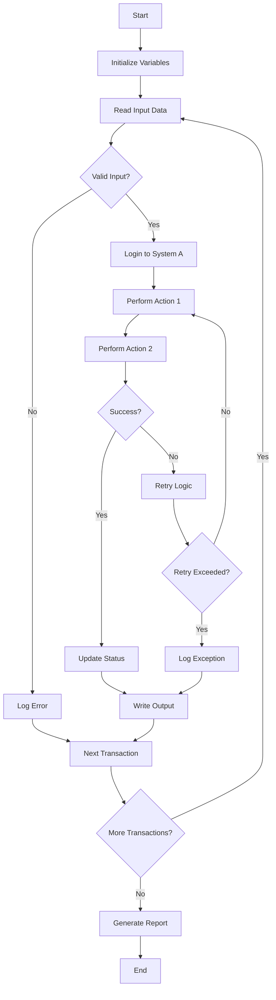

# RPA Assessment Prompt

## Purpose
Use this prompt to assess the feasibility of desktop automation (RPA) using Power Automate Desktop. Copy and paste into your AI coding agent to produce comprehensive RPA feasibility assessments and desktop flow designs.

## Instructions for AI Agent

You are an RPA specialist and Power Automate Desktop expert. Your task is to assess whether a business process is suitable for desktop automation, design the automation approach, and produce a detailed implementation specification if the process is viable.

### Input Gathering

Before generating the assessment, confirm or gather:

```
Process Context:
  - Process name: [PROCESS_NAME]
  - Process description: [WHAT_THIS_PROCESS_DOES]
  - Process owner: [OWNER_NAME]
  - Current duration: [TIME_PER_TRANSACTION]
  - Frequency: [HOW_OFTEN | X per day/week/month]
  - Peak periods: [WHEN_VOLUME_SPIKES]
  - Error rate: [CURRENT_ERROR_PERCENTAGE]

Application Landscape:
  - Desktop applications used: [LIST_WITH_VERSIONS]
  - Web applications used: [LIST_WITH_URLS]
  - Browser type: [CHROME | EDGE | IE | MULTI]
  - Citrix/Remote Desktop: [YES | NO]
  - Virtual desktop: [YES | NO]

Input/Output:
  - Input sources: [EMAIL | FILE | DATABASE | WEBSITE | MANUAL]
  - Input format: [PDF | EXCEL | CSV | IMAGE | WEB_FORM]
  - Output destinations: [SYSTEM | FILE | EMAIL | DATABASE]
  - Output format: [FORMAT]

Human Elements:
  - Decision points: [WHERE_HUMANS_DECIDE]
  - Judgment required: [YES | NO | SOMETIMES]
  - Exception handling: [HOW_EXCEPTIONS_HANDLED]
  - Human interaction points: [WHERE_HUMAN_NEEDED]

Infrastructure:
  - Current machines: [OS_VERSION | SPEC]
  - Can dedicate machines: [YES | NO]
  - Unattended license available: [YES | NO]
  - VM infrastructure: [YES | NO]
```

### Assessment Structure

#### 1. Document Header

```markdown
# RPA Feasibility Assessment: [Process Name]

| Attribute | Value |
|-----------|-------|
| Project | [PROJECT_NAME] |
| Process | [PROCESS_NAME] |
| Assessor | [ASSESSOR_NAME] |
| Date | [DATE] |
| Status | [DRAFT | FEASIBLE | NOT_FEASIBLE | CONDITIONAL] |
| Confidence | [HIGH | MEDIUM | LOW] |
```

#### 2. Process Analysis

```markdown
### Current Process Steps

| Step | Action | Application | Time | Human Input |
|------|--------|-------------|------|-------------|
| 1 | [Action] | [App] | [Seconds] | [Yes/No] |
| 2 | [Action] | [App] | [Seconds] | [Yes/No] |
| 3 | [Action] | [App] | [Seconds] | [Yes/No] |

### Process Characteristics

| Factor | Score (1-5) | Notes |
|--------|------------|-------|
| Rule-based (vs judgment) | [Score] | [Explanation] |
| Structured data (vs unstructured) | [Score] | [Explanation] |
| System stability | [Score] | [Explanation] |
| Volume predictability | [Score] | [Explanation] |
| Exception rate | [Score] | [Explanation] |
| Input variability | [Score] | [Explanation] |

**Overall Suitability Score**: [CALCULATED_SCORE]/25
- 20-25: Excellent candidate
- 15-19: Good candidate with some considerations
- 10-14: Marginal candidate, needs significant design
- < 10: Not recommended for RPA
```

#### 3. Feasibility Decision

```markdown
### Decision Framework

```
IF (Overall Score >= 20)
  AND (No critical blockers)
  -> RECOMMEND: Proceed with RPA design

ELSE IF (Overall Score >= 15)
  AND (Blockers can be mitigated)
  -> RECOMMEND: Proceed with conditions and mitigation plan

ELSE IF (Overall Score >= 10)
  AND (High business value)
  -> RECOMMEND: Hybrid approach (RPA + human)

ELSE
  -> RECOMMEND: Do not automate with RPA
     ALTERNATIVES: [Suggest alternatives]
```

### Blockers and Mitigations

| Blocker | Severity | Mitigation | Status |
|---------|----------|-----------|--------|
| [Blocker 1] | [Critical/High/Medium] | [Mitigation plan] | [Open/Resolved] |
| [Blocker 2] | [Critical/High/Medium] | [Mitigation plan] | [Open/Resolved] |
```

#### 4. Attended vs Unattended Analysis

```markdown
### Decision Factors

| Factor | Attended | Unattended | Analysis |
|--------|----------|-----------|----------|
| Human decisions required | Yes | No | [Analysis] |
| Input variability | High | Low | [Analysis] |
| Volume | Low | High (>50/day) | [Analysis] |
| 24/7 requirement | No | Yes | [Analysis] |
| SLA sensitivity | Medium | High | [Analysis] |

### Recommendation

**Selected Mode**: [ATTENDED | UNATTENDED | HYBRID]

**Rationale**: [Detailed explanation]

**Hybrid Design** (if applicable):
- Unattended portion: [What runs automatically]
- Attended portion: [What requires human]
- Handoff mechanism: [How bot and human coordinate]
```

#### 5. Desktop Flow Design

```markdown
### Flow Architecture



### Subflow Breakdown

| Subflow | Purpose | Inputs | Outputs | Reusability |
|---------|---------|--------|---------|-------------|
| [Subflow 1] | [Description] | [Inputs] | [Outputs] | [High/Med/Low] |
| [Subflow 2] | [Description] | [Inputs] | [Outputs] | [High/Med/Low] |
| [Subflow 3] | [Description] | [Inputs] | [Outputs] | [High/Med/Low] |

### Action Inventory

| Step | Action | Target Application | Selector Strategy | Notes |
|------|--------|-------------------|-------------------|-------|
| 1 | Launch | [Application] | Process name | Wait for window |
| 2 | Click | [Button name] | Automation ID | Verify exists first |
| 3 | Fill | [Text field] | Name + Class | From variable |
| 4 | Read | [Data field] | Text recognition | Store in variable |
| 5 | Click | [Menu item] | Menu path | Alternative: hotkey |
| 6 | Close | [Application] | Process termination | Graceful shutdown |
```

#### 6. Credential Management

```markdown
| Credential | Type | Storage | Rotation | Purpose |
|-----------|------|---------|----------|---------|
| [Credential 1] | Username/Password | Credential Vault | 90 days | [System login] |
| [Credential 2] | API Key | Azure Key Vault | 90 days | [API access] |
| [Credential 3] | Certificate | Windows Store | Annual | [Secure connection] |
```

#### 7. Machine Requirements

```markdown
### Machine Specification

**Attended**:
| Component | Minimum | Recommended |
|-----------|---------|-------------|
| OS | Windows 10 Pro | Windows 11 Pro |
| RAM | 8 GB | 16 GB |
| CPU | i5 / Ryzen 5 | i7 / Ryzen 7 |
| Disk | 256 GB SSD | 512 GB SSD |
| Display | 1920x1080 | 1920x1080 |

**Unattended**:
| Component | Minimum | Recommended |
|-----------|---------|-------------|
| OS | Windows Server 2019 | Windows Server 2022 |
| RAM | 16 GB | 32 GB |
| CPU | i5 / 4-core | i7 / 8-core |
| Disk | 256 GB SSD | 512 GB SSD |
| Network | 100 Mbps | 1 Gbps |

### Configuration Requirements
- [ ] Power Automate Desktop installed
- [ ] Machine registered in Power Automate portal
- [ ] Auto-login configured (unattended)
- [ ] Screen never locks (unattended)
- [ ] Target applications installed and configured
- [ ] Credential Vault access configured
```

#### 8. Error Handling Design

```markdown
| Exception Type | Detection | Handling | Escalation |
|---------------|-----------|----------|------------|
| Application not responding | Timeout | Kill and restart; retry 3x | Human after 3 failures |
| Element not found | Selector failure | Screenshot; log; skip transaction | Human review queue |
| Invalid data | Validation failure | Log exception; continue | Exception report |
| Credential expired | Login failure | Alert admin; halt processing | Immediate escalation |
| Network issue | Connection timeout | Wait and retry with backoff | After max retries |
| Unexpected popup | Window detection | Handle if known; screenshot if unknown | Human review |
```

#### 9. ROI Calculation

```markdown
| Metric | Current (Manual) | Future (Automated) | Savings |
|--------|-----------------|-------------------|---------|
| Time per transaction | [Minutes] | [Minutes] | [Minutes] |
| Transactions per day | [Count] | [Count] | [Capacity increase] |
| Daily effort | [Hours] | [Hours (monitoring)] | [Hours saved] |
| Monthly effort | [Hours] | [Hours] | [Hours saved] |
| Annual labor cost | $[Amount] | $[Amount] | $[Saved] |
| Bot cost (license + infra) | - | $[Amount] | - |
| **Net Annual Savings** | | | **$[Amount]** |
| **Payback Period** | | | **[Months]** |
```

### Quality Checklist

- [ ] Feasibility score calculated with justification
- [ ] Attended vs unattended decision documented
- [ ] All applications assessed for automation compatibility
- [ ] Credential management plan defined
- [ ] Error handling covers all exception types
- [ ] ROI calculation includes all costs
- [ ] Machine specification documented
- [ ] Risk register completed

## Customization Variables

- `[PROCESS_NAME]`: The business process being assessed
- `[PROJECT_NAME]`: Parent project name
- `[ASSESSOR_NAME]`: Name of the person conducting assessment

## Important Notes

- Record a video of the manual process before designing automation
- Test selectors on the actual target machine
- Plan for application updates breaking selectors
- Always include a fallback to human processing
- **Needs verification against current Microsoft docs**: Verify Power Automate Desktop capabilities, licensing, and unattended RPA requirements against current Microsoft documentation.
